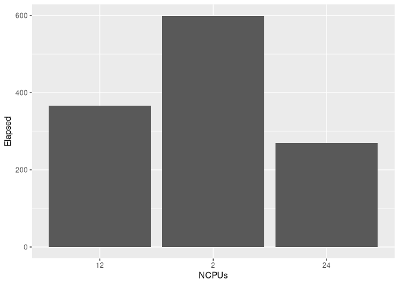

<!-- README.md is generated from README.Rmd. Please edit that file -->

# parseSlurmDuration

<!-- badges: start -->
<!-- badges: end -->

The goal of parseSlurmDuration is to enable analytics of SLURM
accounting data in R without tripping over the `Timelimit`, `Elapsed`,
and `CPUTime` accounting fields.

When publishing academic research that used HPC resources managed with
the SLURM scheduler, it may be beneficial to publish some job statistics
so that end-users of your package or peers reviewing your research
software and data analysis pipeline are able to request sufficient and
(minimally buffered) resources on the computing cluster they have access
to, or know to expect how long their personal or laboratory workstation
or server will be occupied with computation.

The accounting fields mentioned are not in a format that works with the
`lubridate` package, so this package provides the function necessary to
parse those fields and allow analysis.

## Installation

You can install the development version of parseSlurmDuration from
[GitHub](https://github.com/) with:

``` r
# install.packages("devtools")
devtools::install_github("bryce-carson/parseSlurmDuration")
```

## Example

This example shows the absolute minimum necessary to convert some SLURM
accounting data to a format that is usable with lubridate and the rest
of the Tidyverse for any analysis you might want to do.

``` r
library(parseSlurmDuration)
library(lubridate) # as.duration() interests us; the rest is standard data analysis and lubridate usage therein.
#> 
#> Attaching package: 'lubridate'
#> The following objects are masked from 'package:base':
#> 
#>     date, intersect, setdiff, union

# Get some SLURM accounting information that was found online. :)
html <- rvest::read_html("https://ubccr.freshdesk.com/support/solutions/articles/5000686909-how-to-retrieve-job-history-and-accounting")
text <- html %>% rvest::html_nodes("#article-body > div > div > div > div > p:nth-child(36) > font > font") %>% rvest::html_text()
text <- text %>% stringr::str_remove("sacct 2015-01-01 ccrgst3") %>% stringr::str_remove("(.{107})(.{108})") %>% strsplit("\\s+") %>% unlist()
slurmAccountingTable <- tibble(JobID = NA, User = NA, Partition = NA, NNodes = NA, NCPUs = NA, Start = NA, Elapsed = NA, State = NA, Priority = NA)
for (i in seq.int(1, 9*31, by = 9)) {
  rowToAdd <- text[seq(i,i+8)] %>% matrix(nrow = 1)
  colnames(rowToAdd) <- c("JobID", "User", "Partition", "NNodes", "NCPUs", "Start", "Elapsed", "State", "Priority")
  rowToAdd %<>% as_tibble()
  slurmAccountingTable %<>% bind_rows(rowToAdd)
}
slurmAccountingTable %<>% filter(!is.na(across()))

# Convert the Elapsed field to ISO format, then use lubridate to convert it to a class of duration for later analysis.
slurmAccountingTable %<>% mutate(Elapsed = map_chr(Elapsed, parseSlurmDuration) %>% as.duration(),
                                 Start = as_datetime(Start))

# Now we can calculate a field that was missing from the data we downloaded,
slurmAccountingTable %<>% mutate(End = Start + Elapsed)

# and plot the data to see how different jobs compare
filter(slurmAccountingTable, State == "COMPLETED") %>% ggplot() +
  geom_col(mapping = aes(x = NCPUs, y = Elapsed))
```


